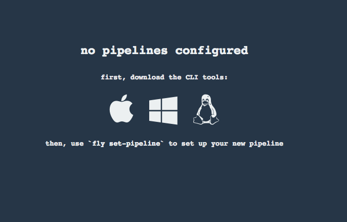

= Prerequisites For Labs

== Install FLY CLI

. Browse to http://concourse.run.cloud.zwickey.net/ and select the icon associated with your platform:
+

. Add the downloaded binary to your system path

. After adding to your system path you should be able to execute the fly command from a terminal window:
+
[source,bash]
---------------------------------------------------------------------
$ fly -version                                                                                                                                  1 ↵
2.6.0
---------------------------------------------------------------------

== Target and Login to Concourse env
