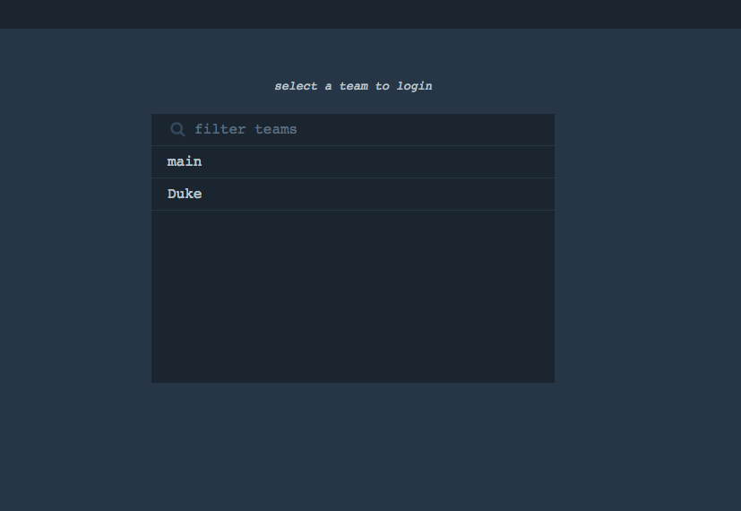
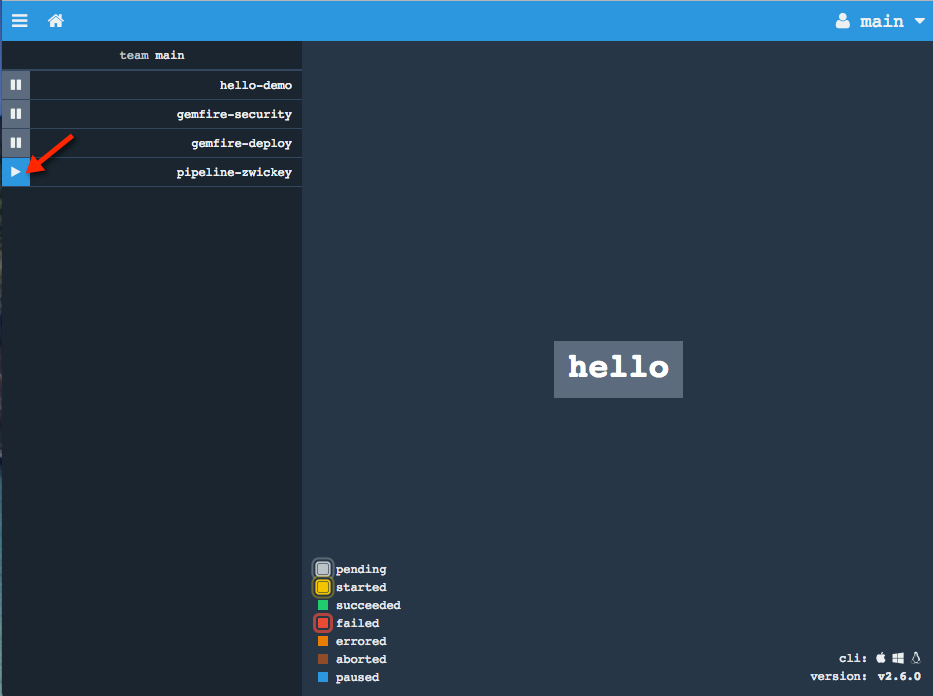
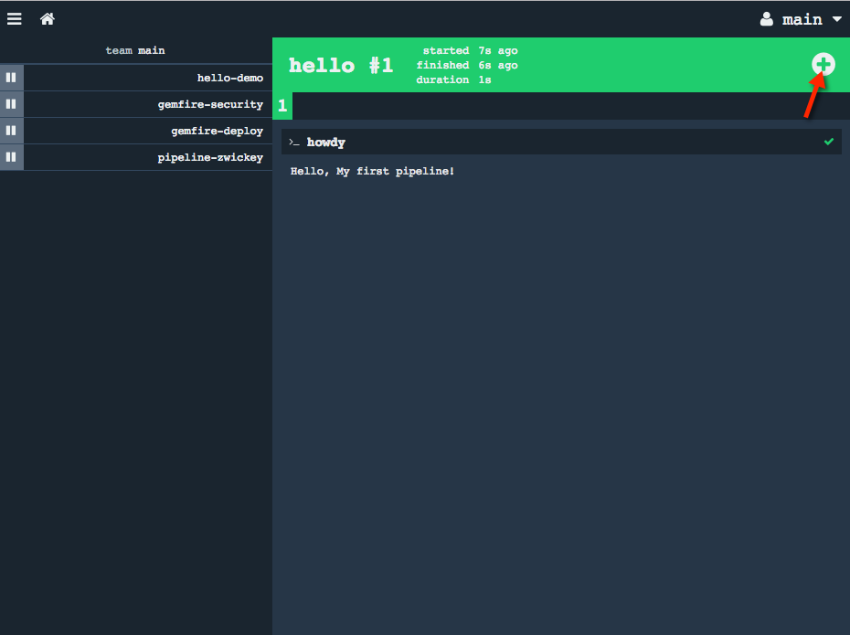

= Lab 02

== 1st Job on Concourse Server

. Modify the file pipeline.yml that you previously created.  In this step we are creating a job within a pipeline, rather than running a one-off task:
+
[source, bash]
---------------------------------------------------------------------
jobs:
- name: hello
  plan:
  - task: howdy
    config:
      platform: linux
      image_resource:
        type: docker-image
        source: {repository: ubuntu}
      run:
        path: echo
        args: ["Hello, My first pipeline!"]
---------------------------------------------------------------------

. To deploy this pipeline to the concourse server use the fly command to set a pipeline.  In the command below replace <LASTNAME> with your lastname.  This will give your pipeline a unique name so as to not collide with the pipelines of others:
+
[source,bash]
---------------------------------------------------------------------
$ fly -t gcp set-pipeline -p pipeline-<LASTNAME> -c pipeline.yml

jobs:
  job hello has been added:
    name: hello
    plan:
    - task: howdy
      config:
        platform: linux
        image_resource:
          type: docker-image
          source:
            repository: ubuntu
        run:
          path: echo
          args:
          - Hello, My first pipeline!
          dir: ""

apply configuration? [yN]: y
pipeline created!
you can view your pipeline here: http://concourse.cloud.zwickey.net:8080/teams/main/pipelines/pipeline-zwickey

the pipeline is currently paused. to unpause, either:
  - run the unpause-pipeline command
  - click play next to the pipeline in the web ui
---------------------------------------------------------------------

. You'll note the command informs us that initially our pipeline is in a paused state.  We could unpause from the commandline, but instead we'll unpause and execute the pipeline from the Concourse web UI.  In a browser navigate to http://concourse.run.cloud.zwickey.net/ and click the "login" link in the upper right corner.

. Select the "main" team to login to and use the credentials previously provided to authenticate
+

. Expand the list of pipelines by clicking the menu icon in the upper left.  You should see you pipeline listed with a blue play button.  Click that button to unpause your pipeline:
+

. Lastly, click on your pipeline and then click on and large box that says "hello" in the center of the screen.  Hello is the name of your job.  After selecting your job click the + sign in the upper right to kickoff the job.
+

