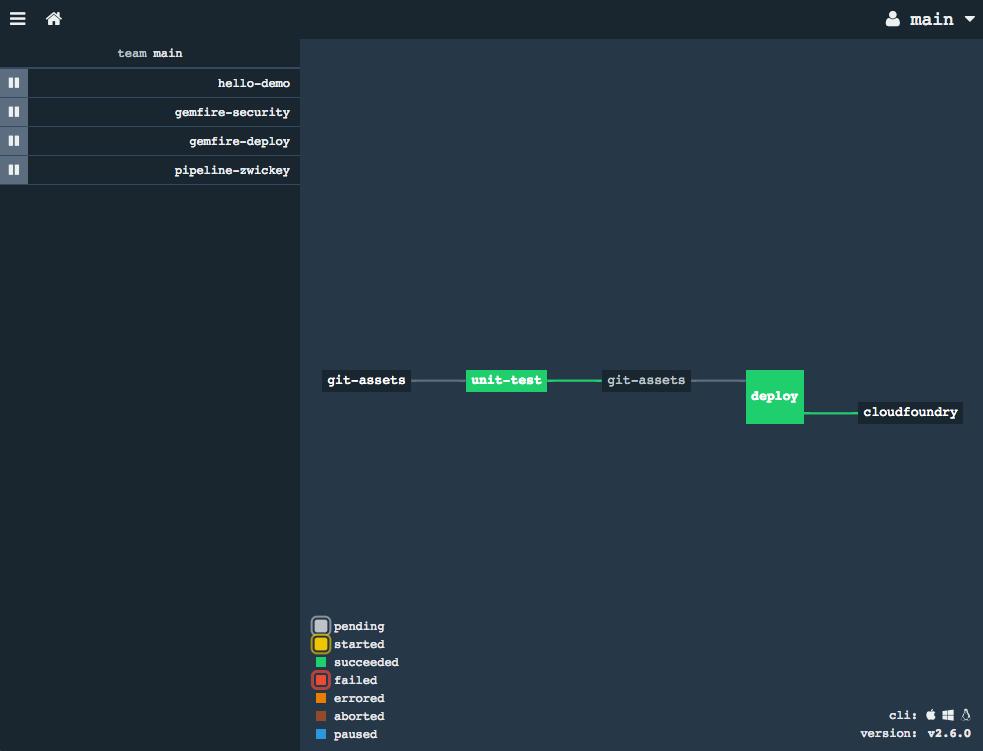
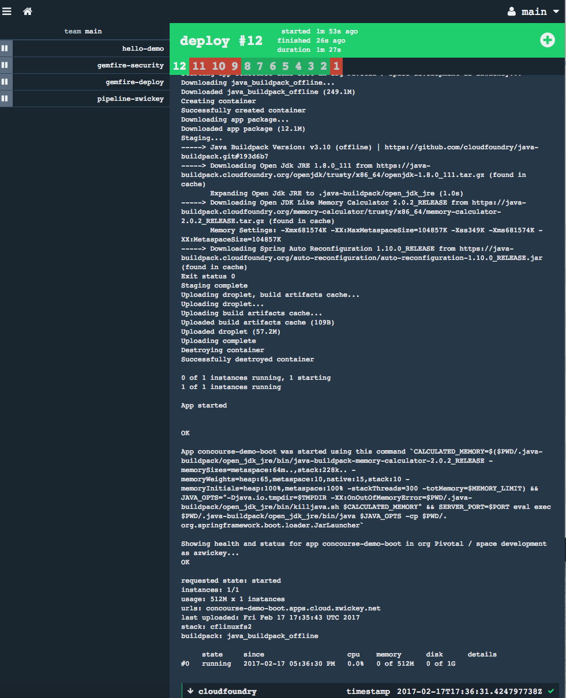

= Lab 06

== Push app to CF

. Lastly, we want to deploy our application to Pivotal Cloudfoundry.  We'll add this to the _deploy_ task within our pipeline.  First, define a Cloudfoundry resource below the git-assets resource:
+
[source,bash]
---------------------------------------------------------------------
- name: cloudfoundry
  type: cf
  source:
    api: {{cf-api}}
    skip_cert_check: true
    organization: {{cf-organization}}
    username: {{cf-username}}
    password: {{cf-password}}
    space: {{cf-space}}
---------------------------------------------------------------------

. You'll note references to values in the pipeline YML in the format of {{SOME-VALUE}}; this is the way to refer to a variable that is configured at deploy time rather than statically in your pipleline.  We need to create a _credentials_ file that will be used when we deploy the pipeline that will populate the variables.  Copy the template file that is already in the git repo:
+
[source,bash]
---------------------------------------------------------------------
$ cp completed-ci/credentials.yml.sample ci/credentials.yml
---------------------------------------------------------------------

. Edit the newly created credentials.yml file to populate it with your specific Cloudfoundry environment information.

. Lastly, we need to add the cf deploy step to our build plan.  Add the following task to the end of your deploy job, right after the mvn-package step.
+
[source,bash]
---------------------------------------------------------------------
- put: cloudfoundry
  params:
    manifest: git-assets/manifest.yml
    path: app-output/concourse-demo.jar
---------------------------------------------------------------------

. Your full pipeline yml should look like this:
+
[source,bash]
---------------------------------------------------------------------
resources:
- name: git-assets
  type: git
  source:
    branch: master
    uri: https://github.com/azwickey-pivotal/concourse-workshop
- name: cloudfoundry
  type: cf
  source:
    api: {{cf-api}}
    skip_cert_check: true
    organization: {{cf-organization}}
    username: {{cf-username}}
    password: {{cf-password}}
    space: {{cf-space}}

jobs:
- name: unit-test
  public: true
  plan:
  - get: git-assets
    trigger: true
  - task: mvn-test
    file: git-assets/ci/tasks/mvn-test.yml
- name: deploy
  public: true
  plan:
  - get: git-assets
    trigger: true
    passed:
      - unit-test
  - task: mvn-package
    file: git-assets/ci/tasks/mvn-package.yml
  - put: cloudfoundry
    params:
      manifest: git-assets/manifest.yml
      path: app-output/concourse-demo.jar

---------------------------------------------------------------------

. Update your concourse pipeline using the fly set-pipeline command.  This time we'll use the _-l_ flag to provide a variables file:
+
[source,bash]
---------------------------------------------------------------------
- put: cloudfoundry
  params:
    manifest: git-assets/manifest.yml
    path: app-output/concourse-demo.jar
---------------------------------------------------------------------

. If you refresh the Concourse web UI you'll note the resource output of _cloudfoundry_ has been added.
+

. Since we didn't modify anything in git our build will not be triggered.  Manually select a task and kick it off.  The end result should be a push of your application to cloudfoundry.
+

. You can verify your application is working by hitting the version /endpoint in your applicaion.  E.G.:
+
[source,bash]
---------------------------------------------------------------------
$ curl http://concourse-demo-boot.apps.cloud.zwickey.net/version
0.0.9-SNAPSHOT
---------------------------------------------------------------------
